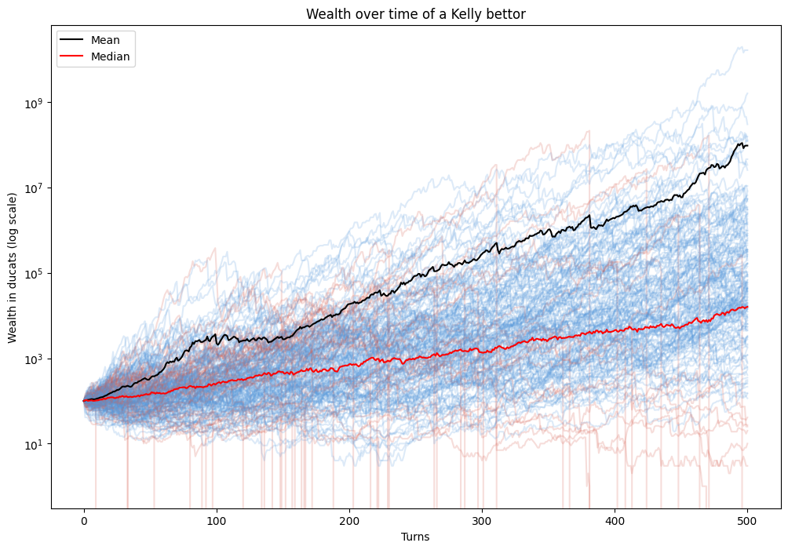
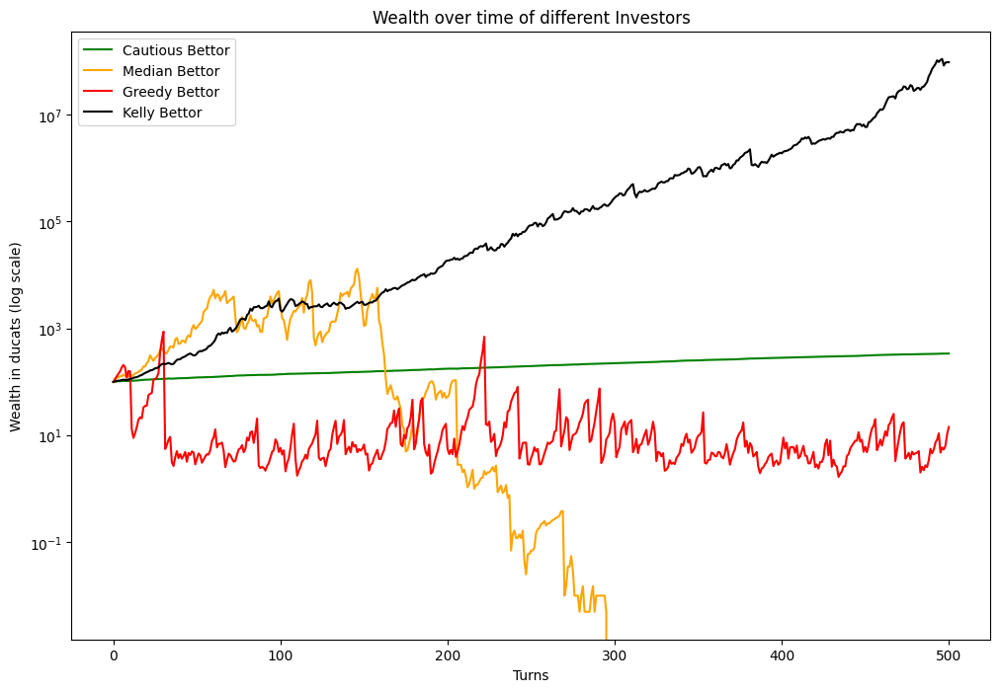

# The Kelly Criterion applied to Ship Investor

See [obrhubr.org/kelly-criterion](https://obrhubr.org/kelly-criterion) for a full writeup.

---

[Ship Investor](https://xkqr.org/ship-investor/ship-investor.html) is a game designed by [Entropic Thoughts](https://entropicthoughts.com) to test your understanding of the Kelly Criterion.

I translated the JS implementation to a python script, so you could experiment with creating different agents and create interesting visualisations of their behaviour.

### How to run

Run `python3 ship_investor.py` to simulate the game.

You can tweak the parameters in `config.py`.
Create new agents in `agents.py`.
Change simulation hyperparameters in `ship_investor.py` by changing how long a game runs for example.

### Examples

Here is what the mean and median wealth of 200 Kelly bettors looks like over 500 steps.

And as you can see, they beat the other agents in the long term.

